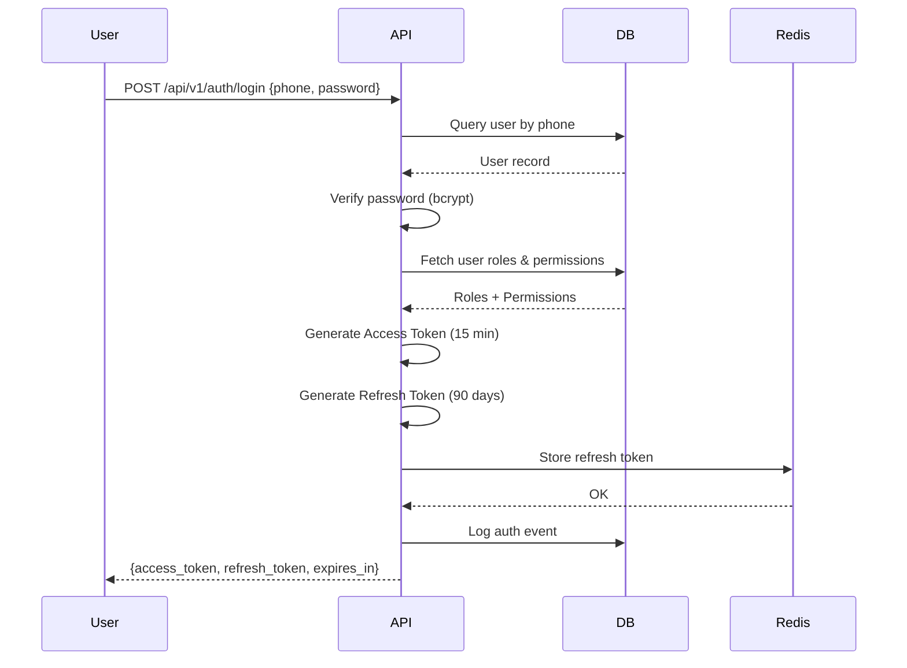
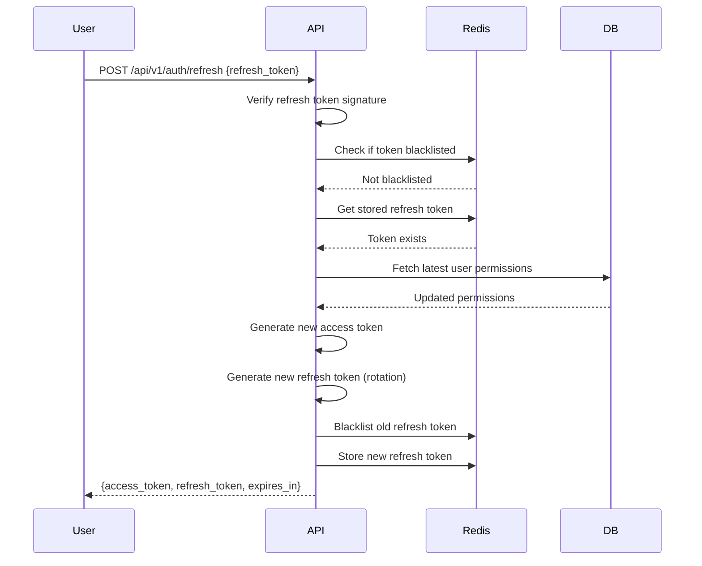

# PHASE_C_AUTH.md

## Phase Identification

- **Phase**: C
- **Name**: Authentication & Authorization
- **Status**: 🟢 Implemented
- **Dependencies**: 
  - Phase A (DATABASE_SCHEMA.md) - `users`, `roles`, `permissions`, `user_roles` tables
  - Phase B (API_CONTRACT.md) - `/api/v1/auth/*` endpoints
  - DOCKER_INFRASTRUCTURE.md - Redis for session management

---

## Purpose

This document is the **single source of truth** for authentication and authorization implementation in BJDMS.

It defines how users:
- Prove their identity (authentication)
- Gain access to resources (authorization)
- Maintain sessions securely
- Have their permissions evaluated

---

## Scope Boundaries

### This Phase Controls

✅ **Authentication Mechanisms**
- JWT token generation and structure
- Refresh token rotation strategy
- Password hashing algorithm (bcrypt, cost factor 12)
- Login flow logic
- Token expiration policies

✅ **Authorization Engine**
- Role-Based Access Control (RBAC) evaluation
- Attribute-Based Access Control (ABAC) for jurisdiction filtering
- Permission resolution algorithm
- Dynamic permission checks

✅ **Session Management**
- Redis-based session storage
- Token blacklisting for logout
- Concurrent session policies
- Session expiration handling

✅ **Security Policies**
- Password complexity requirements
- Account lockout after failed attempts
- Token refresh security
- Audit logging for auth events

---

### This Phase Does NOT Control

❌ **Data Structures** (Owned by DATABASE_SCHEMA.md)
- `users` table schema
- `roles` table definition
- `permissions` table structure

❌ **API Endpoints** (Owned by API_CONTRACT.md)
- `/api/v1/auth/login` request/response format
- `/api/v1/auth/refresh` endpoint structure
- HTTP status codes

❌ **Infrastructure** (Owned by DOCKER_INFRASTRUCTURE.md)
- Redis container configuration
- Network policies
- SSL/TLS termination

❌ **Business Domain Logic** (Owned by respective phase docs)
- What permissions exist (defined per phase)
- Committee-specific authorization rules (PHASE_D_COMMITTEE.md)
- Complaint visibility rules (PHASE_F_COMPLAINT.md)

---

## Implementation Checklist

### Core Authentication
- [x] Password hashing with bcrypt (cost 12)
- [x] JWT token generation (access + refresh)
- [x] Login endpoint implementation
- [x] Token refresh endpoint
- [x] Logout with token blacklist

### Authorization Engine
- [x] RBAC permission checker
- [x] Jurisdiction-aware filtering (ABAC)
- [x] Role assignment validation
- [x] Permission inheritance logic

### Session Management
- [x] Redis session storage
- [x] Token expiration handling
- [x] Concurrent session tracking
- [x] Session cleanup cron job

### Security Features
- [x] Rate limiting on login endpoint (10 attempts / 15 minutes)
- [x] Account lockout after 5 failed attempts
- [x] Secure password reset flow
- [x] Audit logging for all auth events

---

## Technical Details

### JWT Token Structure

#### Access Token
```json
{
  "sub": "user-uuid",
  "role": "district_leader",
  "jurisdiction_id": "jurisdiction-uuid",
  "jurisdiction_level": "district",
  "permissions": ["committee.read", "committee.write", "complaint.read"],
  "exp": 1735987200,
  "iat": 1735983600,
  "jti": "token-unique-id"
}
```

**Expiration**: 15 minutes (900 seconds)

**Claims**:
- `sub`: User UUID
- `role`: Primary role name
- `jurisdiction_id`: User's jurisdiction UUID
- `jurisdiction_level`: central|district|upazila|union|ward
- `permissions`: Array of permission keys
- `exp`: Expiration timestamp
- `iat`: Issued at timestamp
- `jti`: JWT ID for blacklisting

---

#### Refresh Token
```json
{
  "sub": "user-uuid",
  "type": "refresh",
  "exp": 1743759600,
  "iat": 1735983600,
  "jti": "refresh-token-unique-id"
}
```

**Expiration**: 90 days (7,776,000 seconds)

**Storage**: Stored in Redis with key pattern: `refresh_token:{jti}`

---

### Authentication Flow



---

### Token Refresh Flow



---

### Permission Resolution Algorithm

**Evaluation Order**:
1. Verify user is active (`users.is_active = true`)
2. Verify user is verified (`users.verified_at IS NOT NULL`)
3. Load user roles from `user_roles` table
4. Load permissions for each role from `role_permissions`
5. Apply jurisdiction filtering (user can only access data within their jurisdiction or below)
6. Check requested permission exists in resolved permission set

**Pseudocode**:
```
function checkPermission(user_id, permission_key, resource_jurisdiction_id):
  user = getUser(user_id)
  
  if not user.is_active:
    return DENIED
  
  if user.verified_at is NULL:
    return DENIED
  
  user_roles = getUserRoles(user_id)
  permissions = []
  
  for role in user_roles:
    permissions += getRolePermissions(role.role_id)
  
  if permission_key not in permissions:
    return DENIED
  
  // ABAC: Jurisdiction check
  user_jurisdiction = getUserJurisdiction(user_id)
  
  if not isWithinJurisdictionHierarchy(user_jurisdiction, resource_jurisdiction_id):
    return DENIED
  
  return GRANTED
```

---

### Redis Key Patterns

| Purpose | Key Pattern | TTL | Example |
|---------|-------------|-----|---------|
| Refresh token | `refresh_token:{jti}` | 90 days | `refresh_token:abc123...` |
| Blacklisted token | `blacklist:{jti}` | Token expiry | `blacklist:xyz789...` |
| Failed login attempts | `login_attempts:{phone}` | 15 minutes | `login_attempts:+8801712345678` |
| Account lockout | `account_locked:{user_id}` | 30 minutes | `account_locked:user-uuid` |
| Active sessions | `session:{user_id}:{jti}` | 15 minutes | `session:user-uuid:token-id` |

---

### Password Policy

**Requirements**:
- Minimum length: 8 characters
- Must contain: 1 uppercase, 1 lowercase, 1 digit
- Cannot be common passwords (top 10,000 blacklist)
- Cannot be same as previous 3 passwords

**Hashing**:
- Algorithm: bcrypt
- Cost factor: 12
- Salt: Auto-generated per password

**Storage**: Only `password_hash` stored in `users.password_hash` column

---

### Account Lockout Policy

- **Trigger**: 5 failed login attempts within 15 minutes
- **Lockout Duration**: 30 minutes
- **Notification**: Email sent to user (if email exists)
- **Manual Unlock**: Super Admin can unlock via admin panel
- **Audit Log**: All lockouts logged to `audit_logs`

---

### Rate Limiting Rules

| Endpoint | Limit | Window | Action on Exceed |
|----------|-------|--------|------------------|
| `/api/v1/auth/login` | 10 requests | 15 minutes | HTTP 429 + Retry-After header |
| `/api/v1/auth/refresh` | 20 requests | 15 minutes | HTTP 429 |
| `/api/v1/auth/reset-password` | 3 requests | 1 hour | HTTP 429 |

**Implementation**: Redis-based sliding window counter

---

## Business Logic Rules

### Role Assignment Rules

1. **Super Admin**: Can only be assigned by existing Super Admin
2. **Central Leader**: Can be assigned by Super Admin or Central Committee President
3. **District Leader**: Can be assigned by Central Leaders or District Committee President
4. **Unit Leader**: Can be assigned by District Leaders or higher

### Permission Inheritance

Permissions are **NOT** hierarchical by default. Each role must explicitly define permissions.

**Example**: A District Leader does NOT automatically inherit Unit Leader permissions.

### Jurisdiction-Based Access (ABAC)

Users can access resources in:
- Their assigned jurisdiction
- All child jurisdictions below them

**Example**:
- District Leader in "Joypurhat" can access:
  - All Upazilas in Joypurhat
  - All Unions in those Upazilas
  - All Wards in those Unions
- But CANNOT access other districts

**Implementation**: Recursive jurisdiction tree query

---

## Integration Points

### With Phase A (Database)
- Reads from: `users`, `roles`, `permissions`, `user_roles`, `role_permissions`
- Writes to: `audit_logs` (authentication events)

### With Phase B (API)
- Implements authentication for ALL `/api/v1/*` endpoints
- Provides middleware for authorization checks
- Returns standardized error responses per API_CONTRACT.md

### With Phase D (Committee Management)
- Committee-based role assignment triggers permission refresh
- Position changes update user roles

### With Redis (Infrastructure)
- Session storage
- Token blacklisting
- Rate limiting counters

---

## Testing Requirements

### Unit Tests

1. **Password Hashing**
   - Test bcrypt hashing
   - Verify cost factor 12
   - Test password verification

2. **Token Generation**
   - Validate JWT structure
   - Verify claims presence
   - Test expiration calculation

3. **Permission Resolver**
   - Test RBAC logic
   - Test ABAC jurisdiction filtering
   - Test permission denial cases

### Integration Tests

1. **Login Flow**
   - Successful login with valid credentials
   - Failed login with invalid password
   - Account lockout after 5 failures
   - Rate limiting enforcement

2. **Token Refresh**
   - Successful refresh with valid token
   - Rejection of expired refresh token
   - Rejection of blacklisted token
   - Token rotation validation

3. **Authorization**
   - Access granted for valid permission
   - Access denied for missing permission
   - Jurisdiction filtering validation

### Security Tests

1. **Penetration Testing**
   - Brute force attack on login
   - Token tampering attempts
   - SQL injection on login endpoint
   - XSS in error messages

2. **Load Testing**
   - 100 concurrent login requests
   - Token refresh under load
   - Redis session storage performance

---

## Migration Procedures

### Adding New Permission

1. Insert into `permissions` table:
   ```sql
   INSERT INTO permissions (id, key, description)
   VALUES (next_id, 'new.permission', 'Description');
   ```

2. Assign to roles in `role_permissions`:
   ```sql
   INSERT INTO role_permissions (role_id, permission_id)
   VALUES (role_id, new_permission_id);
   ```

3. Update permission documentation in respective phase document

4. **No code changes required** - permission resolver is data-driven

---

### Adding New Role

1. Insert into `roles` table
2. Define default permissions in `role_permissions`
3. Update role assignment rules in this document
4. Update API_CONTRACT.md if new endpoints needed

---

### Changing Token Expiration

1. Update environment variables:
   - `JWT_ACCESS_TOKEN_TTL` (seconds)
   - `JWT_REFRESH_TOKEN_TTL` (seconds)

2. **Backward Compatibility**: Old tokens still valid until their original expiry

3. Document change in this file with date and rationale

---

### Password Policy Changes

1. Update password validation function
2. Apply only to NEW passwords (not retroactive)
3. Notify existing users to update passwords
4. Document change with migration date

---

## Future Extensibility

### Multi-Factor Authentication (MFA)

**Preparation**:
- Database: Add `users.mfa_enabled` (boolean), `users.mfa_secret` (encrypted)
- New table: `mfa_backup_codes`
- API: New endpoints `/api/v1/auth/mfa/setup`, `/api/v1/auth/mfa/verify`

**Impact**: Login flow adds MFA verification step after password check

**Backward Compatibility**: MFA is opt-in, existing flows unchanged

---

### OAuth2 / SSO Integration

**Preparation**:
- New table: `oauth_providers` (Google, Facebook, etc.)
- New table: `user_oauth_links`
- API: `/api/v1/auth/oauth/{provider}/callback`

**Impact**: Alternative login path, does NOT replace phone/password

---

### Biometric Authentication (Future Mobile App)

**Preparation**:
- Device registration: New table `user_devices`
- Public key storage for device verification
- API: `/api/v1/auth/biometric/register`, `/api/v1/auth/biometric/verify`

**Impact**: Additional authentication method, parallel to existing

---

## Security Audit Checklist

- [ ] All passwords hashed with bcrypt cost ≥ 12
- [ ] JWTs signed with strong secret (256-bit minimum)
- [ ] Refresh tokens stored securely in Redis
- [ ] No sensitive data in JWT claims (no passwords, no full names)
- [ ] All auth events logged to `audit_logs`
- [ ] Rate limiting enforced on all auth endpoints
- [ ] Account lockout implemented
- [ ] Token blacklisting functional
- [ ] HTTPS enforced (handled by NGINX per DOCKER_INFRASTRUCTURE.md)
- [ ] CORS configured properly

---

## Common Issues & Solutions

### Issue: "Token expired" immediately after login
**Cause**: Server time mismatch  
**Solution**: Sync server time with NTP

### Issue: Permission denied despite correct role
**Cause**: Cached permissions in JWT  
**Solution**: User must refresh token to get updated permissions

### Issue: Multiple concurrent sessions
**Behavior**: Allowed by default  
**Change**: Set `MAX_CONCURRENT_SESSIONS` env var to limit

---

## Document Version History

| Version | Date | Changes | Author |
|---------|------|---------|--------|
| 1.0 | 2026-01-21 | Initial documentation | System Architect AI |

---

এই ডকুমেন্ট ভাঙলে সিস্টেম ভাঙবে।
এই ডকুমেন্ট ঠিক থাকলে – যত বড়ই হোক – সিস্টেম স্থিতিশীল থাকবে।
