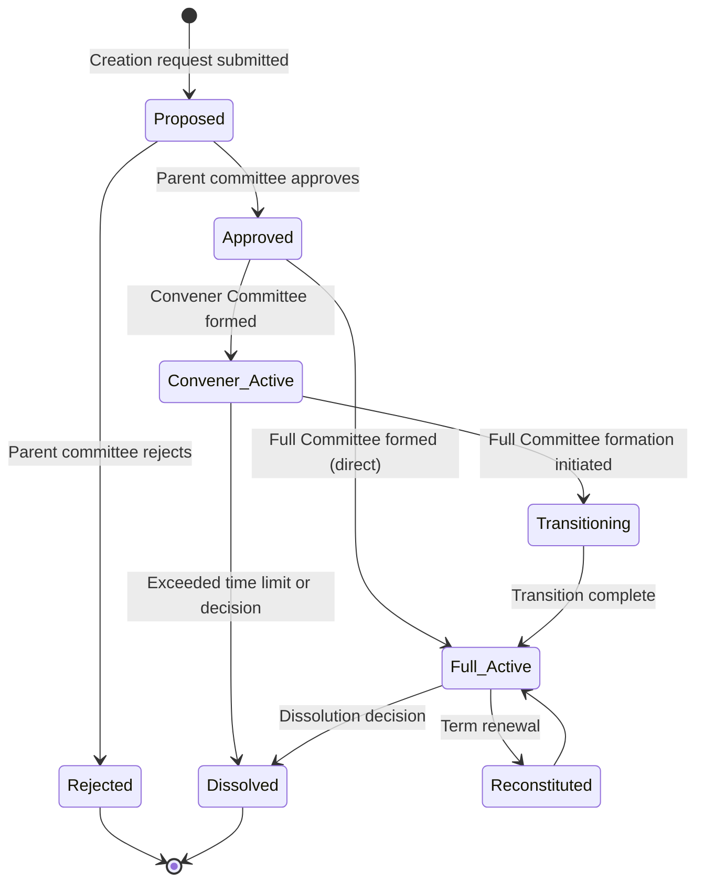

# PHASE_D_COMMITTEE.md

## Phase Identification

- **Phase**: D
- **Name**: Committee Management
- **Status**: 🟢 Implemented
- **Dependencies**:
  - Phase A (DATABASE_SCHEMA.md) - `committees`, `committee_members`, `committee_types`, `positions` tables
  - Phase B (API_CONTRACT.md) - `/api/v1/committees/*` endpoints
  - Phase C (PHASE_C_AUTH.md) - Permission checks for committee operations

---

## Purpose

This document is the **single source of truth** for committee management implementation in BJDMS.

It defines how Bangladesh Jatiotabadi Jubodal committees are:
- Created and dissolved
- Structured (Full vs Convener)
- Populated with members
- Transitioned from interim to permanent structures
- Managed across the organizational hierarchy

---

## Scope Boundaries

### This Phase Controls

✅ **Committee Lifecycle**
- Committee creation workflow
- Committee dissolution process
- Status transitions (active/dissolved)
- Formation and dissolution date tracking

✅ **Committee Types**
- Full Committee structure and rules
- Convener Committee (interim) structure
- Transition logic from Convener → Full Committee
- Position equivalence enforcement

✅ **Member Management**
- Adding members to committees
- Assigning positions to members
- Position change workflow
- Member tenure tracking (started_at, ended_at)
- Maximum member limits per committee level

✅ **Hierarchy Enforcement**
- Committee creation permissions by level
- Parent-child jurisdiction validation
- One active committee per jurisdiction rule
- Approval workflow for lower-level committees

✅ **Position Equivalence Logic**
- Convener = President mapping
- Member Secretary = General Secretary mapping
- Joint Convener transition rules
- Auto-promotion during Full Committee formation

---

### This Phase Does NOT Control

❌ **Data Structures** (Owned by DATABASE_SCHEMA.md)
- `committees` table schema
- `committee_members` table structure
- `positions` table definition

❌ **API Endpoints** (Owned by API_CONTRACT.md)
- Endpoint URLs and HTTP methods
- Request/response formats
- Error codes

❌ **Authorization** (Owned by PHASE_C_AUTH.md)
- Who can create committees
- Permission resolution
- Role-based access

❌ **User Profiles** (Owned by User Profile Module)
- User identity
- User verification status

---

## Implementation Checklist

### Committee Creation
- [x] Create Full Committee
- [x] Create Convener Committee (interim)
- [x] Validate jurisdiction ownership
- [x] Prevent duplicate active committees per jurisdiction
- [x] Record formation date

### Committee Member Management
- [x] Add member to committee
- [x] Assign position to member
- [x] Update member position
- [x] Remove member from committee (set ended_at)
- [x] Validate position uniqueness (one President per committee)

### Committee Type Transitions
- [x] Convener Committee → Full Committee migration
- [x] Position equivalence auto-mapping
- [x] Member carryover logic
- [x] Notification to affected members

### Hierarchy Rules
- [x] Central can create Division/District committees
- [x] District can create Upazila/Municipality committees
- [x] Upazila can create Union committees
- [x] Union can create Ward committees
- [x] No skip-level creation

### Dissolution
- [x] Mark committee as inactive
- [x] Set dissolved_at date
- [x] End all member tenures
- [x] Log dissolution event

---

## Technical Details

### Committee Types

#### 1. Full Committee (Permanent)

**Characteristics**:
- Complete leadership structure
- Up to 151+ members at district level
- Up to 71 members at union level
- Fixed term (typically 2 years, renewable)
- Comprehensive positions list

**Required Positions**:
- President (mandatory, only 1)
- General Secretary (mandatory, only 1)
- Senior Vice President (optional, max 3)
- Vice Presidents (multiple allowed)
- Treasurer (mandatory, only 1)
- Organizational Secretary (mandatory, only 1)
- Various other secretaries

**Creation**:
- Requires approval from parent-level committee
- Must have minimum positions filled: President + General Secretary
- Can only be created if no other active Full Committee exists in same jurisdiction

---

#### 2. Convener Committee (Interim/Transitional)

**Characteristics**:
- Temporary structure
- Small size (typically 3-11 members)
- Limited positions
- Short term (typically 3-6 months)
- Preparatory function

**Required Positions**:
- Convener (mandatory, only 1) - equivalent to President
- Member Secretary (mandatory, only 1) - equivalent to General Secretary
- Joint Convener (optional, 1-2)

**Purpose**:
- Initial organization of new jurisdiction
- Reorganization after dissolution
- Transition period before Full Committee formation
- Draft constitution and bylaws

**Limitations**:
- Cannot create new committees (except at lowest level)
- Cannot dissolve other committees
- Limited financial authority
- Must transition to Full Committee within 6 months (configurable)

---

### Committee Lifecycle State Machine



**States**:
- **Proposed**: Creation request pending approval
- **Approved**: Approved but not yet formed
- **Convener_Active**: Convener Committee actively operating
- **Full_Active**: Full Committee actively operating
- **Transitioning**: In progress from Convener to Full
- **Dissolved**: Committee disbanded
- **Reconstituted**: Full Committee renewed for new term

---

### Hierarchy Rules & Validation

#### Jurisdiction-Based Creation Authority

| Jurisdiction Level | Can Create Committees At | Requires Approval From |
|--------------------|--------------------------|------------------------|
| Central | Division, District | None (highest authority) |
| Division | District | Central Committee |
| District | Upazila, Municipality | Division or Central |
| Upazila | Union | District Committee |
| Municipality | Ward (urban) | District Committee |
| Union | Ward (rural) | Upazila Committee |
| Ward | N/A | Cannot create sub-committees |

**Validation Rules**:
1. Creator's jurisdiction must be parent of target jurisdiction
2. Creator must have permission `committee.create`
3. Creator's position must be President, General Secretary, or Organizational Secretary
4. No existing active committee in target jurisdiction

---

### Position Uniqueness Rules

**Single Position Constraints** (only one person can hold):
- President
- General Secretary
- Senior Vice President (max 3)
- Treasurer
- Organizational Secretary
- Office Secretary

**Multiple Positions Allowed**:
- Vice President (multiple)
- Joint General Secretary (multiple)
- Joint Secretary (multiple)
- Assistant Organizing Secretary (multiple)
- Publicity Secretary (by department)
- Member (unlimited within committee size limit)

**Validation**:
```
ON committee_member INSERT/UPDATE:
  IF position has uniqueness constraint:
    COUNT existing members in same committee with same position
    IF count > 0 AND (not updating same member):
      REJECT with error "Position already occupied"
```

---

### Convener → Full Committee Transition

#### Auto-Mapping Rules

When a Convener Committee transitions to Full Committee:

| Convener Position | Auto-Maps To | Notes |
|-------------------|--------------|-------|
| Convener | President | Mandatory mapping, rank preserved |
| Member Secretary | General Secretary | Mandatory mapping, rank preserved |
| Joint Convener (1st) | Senior Vice President | If exists |
| Joint Convener (2nd) | Vice President | If exists |
| Other Convener Members | Member | Default mapping |

**Workflow**:
1. Full Committee formation initiated by Convener Committee
2. System creates new Full Committee record
3. Auto-maps positions per above table
4. Allows addition of new members with new Full Committee positions
5. Sets Convener Committee status to `dissolved_at`
6. Notifies all affected members
7. Updates `user_roles` to reflect new committee structure
8. Triggers permission refresh for all members

**Code Logic**:
```
function transitionConvenerToFull(convener_committee_id, full_committee_config):
  // Create new Full Committee
  full_committee = createCommittee(
    type: FULL,
    jurisdiction: convener_committee.jurisdiction,
    formed_at: NOW()
  )
  
  // Auto-map members
  convener_members = getCommitteeMembers(convener_committee_id)
  
  for member in convener_members:
    new_position = mapPosition(member.position_id)
    addCommitteeMember(
      committee_id: full_committee.id,
      user_id: member.user_id,
      position_id: new_position,
      started_at: NOW()
    )
    endCommitteeMembership(member.id) // set ended_at
  
  // Add new members from config
  for new_member in full_committee_config.new_members:
    addCommitteeMember(...)
  
  // Dissolve Convener Committee
  dissolveCommittee(convener_committee_id)
  
  // Audit log
  logEvent("committee_transition", convener_committee_id, full_committee.id)
  
  return full_committee
```

---

## Business Logic Rules

### Rule 1: One Active Committee Per Jurisdiction

**Constraint**: Only one active committee (Full OR Convener) can exist per jurisdiction at any time.

**Enforcement**:
```sql
UNIQUE INDEX idx_unique_active_committee ON committees (jurisdiction_id)
WHERE dissolved_at IS NULL;
```

**Exception**: During transition period (< 24 hours), both Convener and Full may coexist momentarily.

---

### Rule 2: Minimum Positions for Formation

**Full Committee**:
- MUST have: President + General Secretary
- SHOULD have: Treasurer + Organizational Secretary
- Formation can be blocked if minimum not met (configurable)

**Convener Committee**:
- MUST have: Convener + Member Secretary
- Formation cannot proceed without these two

---

### Rule 3: Committee Size Limits

Based on research findings and organizational practice:

| Jurisdiction Level | Full Committee Max | Convener Committee Max |
|--------------------|--------------------|-----------------------|
| Central | Unlimited | 21 |
| Division | 201 | 15 |
| District | 151 | 11 |
| Upazila | 101 | 9 |
| Municipality | 101 | 9 |
| Union | 71 | 7 |
| Ward | 31 | 5 |

**Enforcement**: Before adding member, check current count < max limit.

---

### Rule 4: Position Change Workflow

Changing a member's position:

1. **Same Committee, Different Position**:
   - End current membership (set `ended_at`)
   - Create new membership with new position
   - Same `started_at` as original if within grace period (7 days)
   - Log position change event

2. **Different Committee**:
   - End membership in old committee
   - Create membership in new committee
   - Reset `started_at` to NOW()

---

### Rule 5: Convener Committee Time Limit

**Default**: 6 months from formation  
**Configurable**: Can be extended by parent committee approval

**Enforcement**:
- Automated reminder at 5 months
- Warning at 5.5 months
- Auto-dissolution at 6 months if not transitioned (optional strict mode)
- Parent committee can grant extension

---

## Integration Points

### With Phase A (Database)
- Reads: `jurisdiction_levels`, `jurisdictions`, `committee_types`, `positions`
- Writes: `committees`, `committee_members`
- Updates: `users.verified_at` when member assigned to active committee

### With Phase C (Auth)
- Checks permissions: `committee.create`, `committee.write`, `committee.dissolve`
- Triggers permission refresh when member positions change
- Uses jurisdiction hierarchy for ABAC filtering

### With Phase B (API)
- Implements: `POST /api/v1/committees`, `GET /api/v1/committees`, `PATCH /api/v1/committee-members/{id}`
- Returns committee data filtered by user's jurisdiction

### With Join Request Workflow
- Approved join requests can assign users to committees
- Committee leaders review join requests for their jurisdiction

### With Audit System
- Logs: `committee_created`, `committee_dissolved`, `member_added`, `member_removed`, `position_changed`, `committee_transitioned`

---

## Testing Requirements

### Unit Tests

1. **Committee Creation**
   - Create Full Committee with valid data
   - Create Convener Committee
   - Reject duplicate active committee in same jurisdiction
   - Validate required positions present

2. **Position Assignment**
   - Assign unique position (President)
   - Reject duplicate unique position
   - Allow multiple non-unique positions (Vice President)

3. **Transition Logic**
   - Convener → Full with auto-mapping
   - Verify all members carried over
   - Verify old committee dissolved

### Integration Tests

1. **Hierarchy Validation**
   - Central creates District committee ✅
   - District creates Upazila committee ✅
   - Union tries to create District committee ❌
   - Skip-level creation rejected ❌

2. **Permission Integration**
   - User with `committee.create` can create
   - User without permission denied
   - Jurisdiction filtering applied

3. **Size Limits**
   - Add 151 members to district committee ✅
   - Try to add 152nd member ❌

### End-to-End Tests

1. **Full Committee Lifecycle**
   - Create Full Committee
   - Add members
   - Update member positions
   - Dissolve committee
   - Verify all members ended

2. **Convener → Full Transition**
   - Create Convener Committee
   - Add Convener + Member Secretary
   - Operate for period
   - Initiate transition
   - Verify auto-mapping
   - Add additional Full Committee positions
   - Verify old committee dissolved

---

## Migration Procedures

### Adding New Position Type

1. Insert into `positions` table with appropriate rank
2. Update position uniqueness rules if needed
3. Document in this file
4. No code changes if rank-based logic used

### Changing Committee Size Limits

1. Update configuration (environment variable or database config table)
2. NO retroactive enforcement (existing committees grandfathered)
3. New members added after change must follow new limit

### Handling Historical Data

**Scenario**: Committee structures existed before system digitalization

**Approach**:
1. Import historical committees with actual `formed_at` dates
2. Mark system start date in metadata
3. Member `started_at` may predate system (allow past dates)
4. Historical committees treated as Full Committees
5. Missing position data filled with "Member" as default

---

## Future Extensibility

### Committee Templates

**Preparation**:
- New table: `committee_templates` (predefined position structures)
- Quick committee creation from template
- Jurisdiction-level-specific templates

### Term Limits & Elections

**Preparation**:
- Add `committees.term_end_date`
- Add `committees.election_date`
- Automated term renewal workflow
- Election result integration

### Sub-Committees / Working Groups

**Preparation**:
- New table: `sub_committees` (FK to parent committee)
- Ad-hoc working groups for specific tasks
- Temporary member assignments

---

## Common Issues & Solutions

### Issue: Two active committees in same jurisdiction
**Cause**: Race condition during creation  
**Solution**: Database unique constraint + application-level locking

### Issue: Position auto-mapping failed during transition
**Cause**: Missing Member Secretary in Convener Committee  
**Solution**: Validation before transition initiation

### Issue: Cannot remove member
**Cause**: Last President or General Secretary  
**Solution**: Require replacement before removal

---

## Document Version History

| Version | Date | Changes | Author |
|---------|------|---------|--------|
| 1.0 | 2026-01-21 | Initial documentation aligned with research | System Architect AI |

---

এই ডকুমেন্ট ভাঙলে সিস্টেম ভাঙবে।
এই ডকুমেন্ট ঠিক থাকলে – যত বড়ই হোক – সিস্টেম স্থিতিশীল থাকবে।
