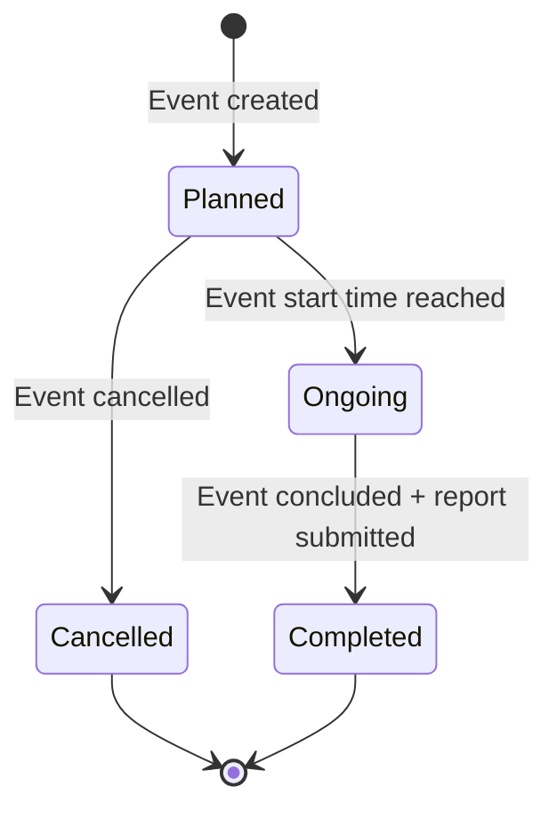

# PHASE_E_ACTIVITY.md

## Phase Identification

- **Phase**: E
- **Name**: Activity, Task & Event Management
- **Status**: 🟡 In Progress (Activity Log implemented, Task & Event planned)
- **Dependencies**:
  - Phase A (DATABASE_SCHEMA.md) - `activities` table (additional tables for tasks/events needed)
  - Phase B (API_CONTRACT.md) - Activity/Task/Event API endpoints
  - Phase C (PHASE_C_AUTH.md) - Permissions for submitting/approving activities
  - Phase D (PHASE_D_COMMITTEE.md) -Committee structure for approvals

---

## Purpose

This document defines how Bangladesh Jat iot abadi Jubodal tracks organizational activities, assigns tasks, and manages events across all hierarchical levels.

**Core Functions**:
- Daily activity logging by committee members
- Task assignment and progress tracking
- Event creation, attendance, and reporting
- Proof/evidence upload for transparency
- Approval workflows for accountability

---

## Scope Boundaries

### This Phase Controls

✅ **Activity Logging**
- Daily/weekly activity submission by members
- Activity description and categorization
- Proof upload (photos, documents, videos)
- Approval workflow (committee leader review)
- Activity visibility by jurisdiction

✅ **Task Management**
- Task creation and assignment
- Deadline tracking
- Progress updates (not started, in progress, completed)
- Task escalation for overdue items
- Reporting hierarchy

✅ **Event Management**
- Event creation (rallies, meetings, training)
- Event announcement and invitations
- Attendance tracking
- Event reports and outcomes
- Media/proof upload

---

### This Phase Does NOT Control

❌ ** Database Tables** (Owned by DATABASE_SCHEMA.md)
- Schema definitions (to be added for tasks/events)

❌ **File Storage** (Owned by DOCKER_INFRASTRUCTURE.md)
- S3-compatible storage configuration
- File upload limits

❌ **Permissions** (Owned by PHASE_C_AUTH.md)
- Who can approve activities
- Who can assign tasks

---

## Implementation Checklist

### Activity Log (Phase 2.1)
- [x] Activity submission API
- [x] Proof upload to S3
- [x] Approval workflow
- [x] Activity listing (filtered by jurisdiction)
- [ ] Activity categories/tags
- [ ] Activity analytics dashboard

### Task Management (Phase 2.2)
- [ ] Task creation
- [ ] Task assignment to specific users
- [ ] Deadline management
- [ ] Progress tracking
- [ ] Task completion workflow
- [ ] Overdue task alerts
- [ ] Task reporting

### Event Management (Phase 2.3)
- [ ] Event creation
- [ ] Event categories (rally, meeting, training, social)
- [ ] Attendance registration
- [ ] QR code check-in (future)
- [ ] Event reports
- [ ] Post-event media upload

---

## Technical Details

### Activity Logging

#### Activity Table (Existing - to be expanded)

**Current DATABASE_SCHEMA.md**:
```
activities:
- id (uuid)
- user_id (uuid FK)
- jurisdiction_id (uuid FK)
- title (varchar)
- description (text)
- created_at (timestamp)
```

**Required Extensions**:
```
Add columns:
- category (varchar): meeting, mobilization, publicity, training, social_work, other
- status (varchar): pending, approved, rejected
- approved_by (uuid FK): references users
- approved_at (timestamp): nullable
- rejection_reason (text): nullable
- is_public (boolean): visible to public or committee-only
```

**New Table: `activity_proofs`**:
```
- id (uuid PK)
- activity_id (uuid FK)
- file_path (text): S3 path
- file_type (varchar): image, video, document
- uploaded_at (timestamp)
```

#### Activity Submission Workflow

```mer maid
sequenceDiagram
    participant Member
    participant API
    participant DB
    participant S3
    participant Approver

    Member->>API: POST /api/v1/activities {title, description, category}
    API->>DB: Create activity (status=pending)
    DB-->>API: Activity ID
    
    Member->>API: POST /api/v1/activities/{id}/proofs (files)
    API->>S3: Upload proof files
    S3-->>API: File URLs
    API->>DB: Store activity_proofs records
    
    API-->>Member: Activity submitted (awaiting approval)
    
    API->>Approver: Notification (real-time)
    
    Approver->>API: PATCH /api/v1/activities/{id} {status: approved}
    API->>DB: Update activity (status=approved, approved_by, approved_at)
    API-->>Member: Notification (activity approved)
```

**Approval Rules**:
- Committee President, General Secretary, or Organizational Secretary can approve
- Activities are auto-approved if submitted by President/General Secretary (configurable)
- Approval required within 48 hours, else escalated to parent jurisdiction
- Rejected activities can be resubmitted after revision

---

### Task Management

#### Task Tables (To be added to DATABASE_SCHEMA.md)

**Table: `tasks`**:
```
- id (uuid PK)
- title (varchar)
- description (text)
- created_by (uuid FK): references users
- assigned_to (uuid FK): references users, nullable (can be assigned to committee)
- assigned_committee_id (uuid FK): nullable
- jurisdiction_id (uuid FK)
- priority (varchar): low, medium, high, urgent
- status (varchar): not_started, in_progress, completed, cancelled
- deadline (timestamp)
- completed_at (timestamp): nullable
- created_at (timestamp)
- updated_at (timestamp)
```

**Table: `task_updates`**:
```
- id (uuid PK)
- task_id (uuid FK)
- user_id (uuid FK)
- update_text (text)
- status_changed_to (varchar): nullable
- created_at (timestamp)
```

**Table: `task_attachments`**:
```
- id (uuid PK)
- task_id (uuid FK)
- file_path (text)
- uploaded_by (uuid FK)
- uploaded_at (timestamp)
```

#### Task Assignment Logic

**Who Can Assign Tasks**:
- Committee leaders (President, General Secretary, Organizational Secretary)
- Assign to members within their jurisdiction or child jurisdictions
- Cannot assign to parent jurisdiction

**Assignment Types**:
1. **Individual Assignment**: Assign to specific user
2. **Committee Assignment**: Assign to entire committee (any member can complete)
3. **Broadcast**: Assign to all committees in child jurisdictions

**Deadline Management**:
- Task overdue if not completed by deadline
- Auto-notification at 24 hours before deadline
- Escalation to assigner if overdue by 48 hours
- Weekly overdue task digest to committee leaders

---

### Event Management

#### Event Tables (To be added to DATABASE_SCHEMA.md)

**Table: `events`**:
```
- id (uuid PK)
- title (varchar)
- title_bn (varchar): Bengali title
- description (text)
- description_bn (text)
- created_by (uuid FK)
- jurisdiction_id (uuid FK)
- event_type (varchar): rally, meeting, training, seminar, social_program
- venue_name (varchar)
- venue_address (text)
- venue_coordinates (geography): PostGIS point, optional
- start_time (timestamp)
- end_time (timestamp)
- expected_attendees (integer): estimated count
- is_public (boolean): open to non-members
- registration_required (boolean)
- registration_deadline (timestamp): nullable
- status (varchar): planned, ongoing, completed, cancelled
- created_at (timestamp)
- updated_at (timestamp)
```

**Table: `event_attendees`**:
```
- id (uuid PK)
- event_id (uuid FK)
- user_id (uuid FK): nullable for non committee members
- full_name (varchar): for non-members
- phone (varchar): nullable
- checked_in (boolean): default false
- checked_in_at (timestamp): nullable
- created_at (timestamp)
```

**Table: `event_media`**:
```
- id (uuid PK)
- event_id (uuid FK)
- file_path (text)
- file_type (varchar): image, video
- caption (text): nullable
- uploaded_by (uuid FK)
- uploaded_at (timestamp)
```

#### Event Creation Workflow



**Event Creation Permissions**:
- Committee leaders can create events for their jurisdiction
- Events can target multiple jurisdictions (e.g., Central event for all districts)
- Public events visible to non-logged-in users

**Attendance Tracking**:
1. **Pre-registration**: Users register before event (if registration_required=true)
2. **Check-in**: Present at event → mark checked_in=true
3. **Post-event**: Upload photos/videos as proof
4. **Report**: Final attendance count, outcomes, media

---

## Business Logic Rules

### Activity Approval Hierarchy

- Ward activity → Approved by Union committee
- Union activity → Approved by Upazila/Municipality committee
- Upazila/Municipality activity → Approved by District committee
- District activity → Approved by Division/Central committee
- Central activity → Auto-approved (highest authority)

**Override**: Central committee can approve/reject activities at any level

---

### Task Priority Escalation

| Priority | Deadline Notification | Escalation |
|----------|----------------------|------------|
| Low | 3 days before | 7 days overdue |
| Medium | 2 days before | 3 days overdue |
| High | 1 day before | 1 day overdue |
| Urgent | 6 hours before | Immediate |

---

### Event Attendance Validation

- Attendance count ≤ expected_attendees → Normal
- Attendance count > expected_attendees * 1.2 → Flag for review (success indicator)
- Attendance count < expected_attendees * 0.5 → Flag for review (low turnout)

---

## Integration Points

### With Phase C (Auth)
- Permissions: `activity.submit`, `activity.approve`, `task.create`, `task.assign`, `event.create`
- Jurisdiction-based filtering for all activity/task/event lists

### With Phase D (Committee)
- Tasks assigned to committees
- Events target committee members
- Activity approval by committee leaders

### With File Storage (Infrastructure)
- S3/MinIO for proof uploads
- File size limits: 10MB per image, 100MB per video
- Allowed formats: jpg, png, pdf, mp4, mov

### With Real-time System (Future)
- Notifications for task assignments
- Event reminders
- Activity approval status updates

---

## Testing Requirements

### Activity Tests
- Submit activity with proof
- Approve activity
- Reject activity with reason
- Jurisdiction filtering

### Task Tests
- Create task
- Assign to individual
- Assign to committee
- Update status
- Complete task
- Overdue detection

### Event Tests
- Create public event
- Register for event
- Check-in at event
- Upload event media
- Complete event report

---

## Migration Procedures

### Adding New Activity Categories

1. Update `activity.category` ENUM/VARCHAR constraints
2. Document in this file
3. Update frontend dropdown options

### Adding New Event Types

1. Update `events.event_type` values
2. Update event creation UI
3. No code changes needed if type-agnostic logic used

---

## Future Extensibility

### Activity Heatmap (Phase 6 - AI Layer)

- Geographic heatmap of activities
- Time-series activity trends
- Jurisdiction comparison

### Gamification

- Activity points system
- Leaderboard by jurisdiction
- Badges for task completion
- Member of the month

### Mobile App Integration

- Offline activity submission
- Photo upload from mobile
- QR code event check-in
- Push notifications for tasks

---

এই ডকুমেন্ট ভাঙলে সিস্টেম ভাঙবে।
এই ডকুমেন্ট ঠিক থাকলে – যত বড়ই হোক – সিস্টেম স্থিতিশীল থাকবে।
