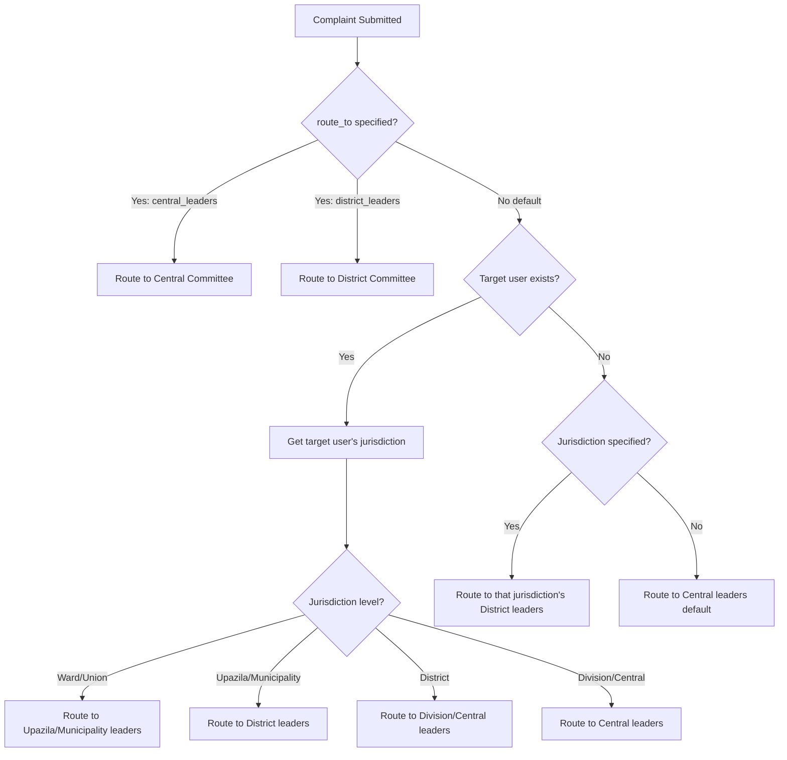
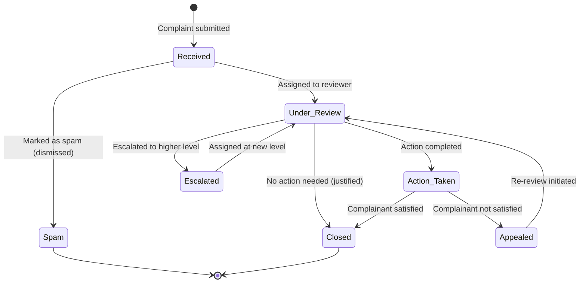

# PHASE_F_COMPLAINT.md

## Phase Identification

- **Phase**: F
- **Name**: Complaint & Whistleblower System
- **Status**: 🟡 Partial (Intake & Routing implemented, Lifecycle planned)
- **Dependencies**:
  - Phase A (DATABASE_SCHEMA.md) - `complaints`, `complaint_evidence` tables
  - Phase B (API_CONTRACT.md) - `/api/v1/complaints` endpoints
  - Phase C (PHASE_C_AUTH.md) - Role-based complaint visibility
  - Phase D (PHASE_D_COMMITTEE.md) - Committee structure for routing

---

## Purpose

This document defines the **complaint and whistleblower system** for Bangladesh Jatiotabadi Jubodal.

**Critical User Intent**: "Anyone (logged in or not) can submit complaints"

**Core Functions**:
- Named and anonymous complaint submission  
- Evidence upload (photos, documents, videos)
- Hierarchical routing (Default: District Leaders, Optional: Central Leaders)
- Role-based visibility
- Status lifecycle tracking
- Anonymity preservation for whistleblowers

---

## Scope Boundaries

### This Phase Controls

✅ **Complaint Intake**
- Public complaint form (no login required)
- Authenticated user complaints
- Anonymous complaint handling
- Evidence file upload
- Captcha/rate limiting for public submissions

✅ **Complaint Routing Logic**
- Default routing to District-level committee leaders
- Optional escalation to Central leaders
- Auto-routing based on target user's jurisdiction
- Manual re-routing by authorized users

✅ **Complaint Lifecycle**
- Status: Received → Under Review → Action Taken → Closed
- Status transition rules
- Timeline tracking
- Resolution documentation

✅ **An onymity Preservation**
- Anonymous complaint metadata handling
- IP address hashing
- Secure evidence storage
- Restricted access to submitter identity

✅ **Visibility & Permissions**
- Who can view which complaints
- Evidence access control
- Response/action logging

---

### This Phase Does NOT Control

❌ **Database Schema** (Owned by DATABASE_SCHEMA.md)
- `complaints` table structure
- `complaint_evidence` table

❌ **File Storage** (Owned by DOCKER_INFRASTRUCTURE.md)
- S3 configuration
- Encryption at rest

❌ **Permissions** (Owned by PHASE_C_AUTH.md)
- Permission definitions
- Role assignments

---

## Implementation Checklist

### Complaint Intake (Phase 3.1)
- [x] Named complaint submission (authenticated)
- [x] Anonymous complaint submission (public)
- [x] Evidence upload
- [x] Captcha on public form
- [x] Rate limiting (10 submissions per IP per day)
- [ ] Multi-language support (Bangla/English)

### Complaint Routing (Phase 3.2)
- [x] Default routing to District Leaders
- [x] Optional Central Leaders routing
- [x] Auto-routing based on target jurisdiction
- [ ] Manual re-routing by supervisors
- [ ] Routing audit trail

### Complaint Lifecycle (Phase 3.3)
- [ ] Status: Received (auto on submission)
- [ ] Status: Under Review (when assigned)
- [ ] Status: Action Taken (when resolved)
- [ ] Status: Closed (final status)
- [ ] Status change notifications
- [ ] Resolution documentation
- [ ] Appeal mechanism

---

## Technical Details

### Complaint Submission Endpoints

#### 1. Public Anonymous Complaint (NO LOGIN REQUIRED)

**Endpoint**: `POST /api/v1/complaints/submit/anonymous`

**Request**:
```json
{
  "target_user_id": "uuid or null",
  "target_full_name": "string if target_user_id is null",
  "jurisdiction_id": "uuid",
  "description": "Detailed complaint",
  "description_bn": "বিস্তার

িত অভিযোগ",
  "route_to": "district_leaders | central_leaders",
  "evidence_files": ["file1.jpg", "file2.pdf"],
  "captcha_token": "recaptcha_token"
}
```

**Response**:
```json
{
  "complaint_id": "uuid",
  "reference_number": "CMPL-2026-0001234",
  "status": "received",
  "message": "Your complaint has been received. Reference: CMPL-2026-0001234"
}
```

**Security Measures**:
- Captcha required (Google reCAPTCHA v3)
- Rate limit: 10 submissions per IP per 24 hours
- IP address hashed (SHA-256) and stored separately
- No submitter tracking cookie
- Evidence files virus-scanned before storage

---

#### 2. Authenticated Named Complaint

**Endpoint**: `POST /api/v1/complaints` (Requires JWT)

**Request**:
```json
{
  "target_user_id": "uuid",
  "jurisdiction_id": "uuid",
  "description": "Complaint text",
  "is_anonymous": false,
  "route_to": "district_leaders | central_leaders"
}
```

**Response**: Same as anonymous, but `submitted_by` is linked to authenticated user

**Benefit of Named Complaint**:
- Can track complaint status via dashboard
- Can receive updates/notifications
- Can upload additional evidence later
- Can escalate if unsatisfied

---

### Complaint Routing Logic

#### Auto-Routing Decision Tree



**Routing Table**:

| Target User's Level | Default Route To |
|---------------------|------------------|
| Ward | Upazila/Municipality Leaders |
| Union | Upazila Leaders |
| Upazila | District Leaders |
| Municipality | District Leaders |
| District | Division or Central Leaders |
| Division | Central Leaders |
| Central | Central Disciplinary Committee |

**Override**: Complainant can always choose to route directly to Central Leaders

---

### Anonymity Preservation

#### Anonymous Complaint Metadata Handling

**Stored in `complaints` table**:
- `submitted_by` = NULL
- `is_anonymous` = TRUE
- `description` (complaint text)
- `target_user_id`
- `jurisdiction_id`
- `created_at`

**Stored in separate secure table `anonymous_complaint_metadata`** (restricted access):
```sql
CREATE TABLE anonymous_complaint_metadata (
  id uuid PRIMARY KEY,
  complaint_id uuid UNIQUE REFERENCES complaints(id),
  ip_address_hash varchar(64), -- SHA-256 hash
  user_agent_hash varchar(64),
  submission_timestamp timestamp,
  captcha_score decimal,
  created_at timestamp
);
```

**Access Control**:
- Only Super Admins can query `anonymous_complaint_metadata`
- Used only for abuse detection (multiple complaints from same IP)
- Cannot reverse-trace to individual
- Deleted after 90 days (configurable)

**Evidence Files**:
- Stored in separate S3 bucket with restricted access
- File metadata stripped (EXIF data removed)
- Accessible only to complaint reviewers
- Logged access (who viewed, when)

---

### Complaint Visibility Rules

**Authenticated User Complaints** (is_anonymous = FALSE):

| User Role | Can View |
|-----------|----------|
| Complainant | Own complaints only |
| Target User | Complaints about them (after status = under_review) |
| Committee President/Gen Sec | Complaints routed to their jurisdiction |
| Central Leaders | All complaints |
| Super Admin | All complaints + metadata |

**Anonymous Complaints** (is_anonymous = TRUE):

| User Role | Can View |
|-----------|----------|
| Committee Leaders | Complaints routed to them (no submitter info) |
| Central Leaders | All anonymous complaints |
| Super Admin | All + access logs |

**Visibility Query Example**:
```sql
SELECT * FROM complaints
WHERE 
  (is_anonymous = FALSE AND submitted_by = current_user_id)
  OR (routed_to_jurisdiction_id IN (user_accessible_jurisdictions))
  OR (current_user_role = 'super_admin')
```

---

### Complaint Lifecycle State Machine



**Status Definitions**:

1. **Received**: Complaint submitted, awaiting assignment
2. **Under Review**: Assigned to committee leader, investigation ongoing
3. **Action Taken**: Corrective action completed or decision made
4. **Escalated**: Sent to higher jurisdiction for review
5. **Closed**: Final resolution, no further action
6. **Spam**: Identified as false/spam complaint (requires justification)
7. **Appealed**: Complainant requests re-review

**Status Transition Permissions**:
- Received → Under Review: Auto on assignment, or manual by committee leader
- Under Review → Action Taken: Only assigned reviewer
- Action Taken → Closed: Reviewer or complainant (if satisfied)
- Any → Escalated: Committee leader or complainant
- Under Review → Spam: Requires justification + supervisor approval

---

## Business Logic Rules

### Rule 1: Target User Notification Timing

**Named Complaints**:
- Target user notified when status = Under Review
- Not notified at "Received" to allow preliminary review
- Prevents intimidation before investigation

**Anonymous Complaints**:
- Target user notified when status = Under Review
- No submitter information revealed
- Target can respond but cannot know complainant

---

### Rule 2: Evidence Access Logging

All evidence file access logged:
```
evidence_access_log:
- id  
- complaint_evidence_id
- accessed_by (user_id)
- accessed_at (timestamp)
- ip_address
```

Purpose: Detect unauthorized access to sensitive complaint evidence

---

### Rule 3: Complaint Escalation

**Auto-Escalation Triggers**:
- No status change for 15 days → Auto-notify supervisor
- No status change for 30 days → Auto-escalate to parent jurisdiction
- Complainant manual escalation request

**Manual Escalation**:
- Complaint about senior leader → Escalate to Central
- Systemic issue → Escalate for policy decision

---

### Rule 4: Anonymous Complaint Limits

To prevent spam while preserving anonymity:
- Max 10 anonymous complaints per IP per 24 hours
- Captcha score < 0.5 → Requires manual review before routing
- Flagged IPs (repeated spam) → All complaints go to manual review queue

---

## Integration Points

### With Phase C (Auth)
- Permissions: `complaint.view`, `complaint.review`, `complaint.action`, `complaint.escalate`
- Jurisdiction-based visibility filtering
- Role-based routing

### With Phase D (Committee)
- Complaints routed to committee leaders
- Committee structure determines reviewers
- Position changes affect complaint routing

### With File Storage
- S3/MinIO for evidence files
- EXIF stripping for anonymity
- Virus scanning (ClamAV)
- Access logging

### With Notification System (Real-time)
- Complaint received → Reviewer notified  
- Status changed → Complainant notified (if authenticated)
- Escalation → New reviewer notified

---

## Testing Requirements

### Complaint Submission Tests
- Submit anonymous complaint without login
- Submit named complaint with login
- Upload evidence files
- Captcha validation
- Rate limiting enforcement

### Routing Tests
- Auto-routing based on jurisdiction
- Manual central leaders routing
- Escalation workflow
- Cross-jurisdiction complaints

### Anonymity Tests
- Verify no submitter info in anonymous complaints
- Verify metadata separation
- Verify IP hashing
- Verify evidence access logging

### Visibility Tests
- Complainant sees own complaints
- Target user sees complaints about them (when under review)
- Committee leaders see routed complaints
- Unauthorized users cannot view

---

## Migration Procedures

### Adding New Complaint Categories

Future enhancement for categorized complaints (corruption, misconduct, policy violation):

1. Add `complaint_category` table
2. Add `category_id` FK to `complaints`
3. Category-based routing rules
4. NO changes to core complaint logic

---

## Future Extensibility

### Complaint Dashboard Analytics

- Total complaints by jurisdiction
- Resolution time metrics
- Status distribution
- Anonymous vs named ratio
- Trending issues

### AI-Powered Complaint Categorization

- Auto-detect complaint type from description
- Suggest routing based on content
- Flag urgent/sensitive complaints
- Duplicate detection

### Public Complaint Portal

- Dedicated subdomain: complaints.jubodal.org
- Public-facing complaint submission
- Status check by reference number
- Transparency report (anonymized stats)

---

## Security Considerations

### GDPR-Equivalent Compliance (Bangladesh Context)

- Anonymous complaints: No personal data stored
- Named complaints: Complainant can request deletion after resolution
- Evidence files: Deleted 2 years after complaint closed (configurable)
- Access logs: Retained for 5 years for audit

### Threat Model

**Threat 1**: Malicious mass complaints to harass individuals
- **Mitigation**: Captcha, rate limiting, manual review queue, spam detection

**Threat 2**: Identity leakage of anonymous complainant
- **Mitigation**: Metadata separation, IP hashing, access logging, strict permissions

**Threat 3**: Evidence tampering
- **Mitigation**: Immutable S3 storage, file hash verification, access logging

**Threat 4**: Unauthorized access to complaints
- **Mitigation**: Row-level security, jurisdiction filtering, audit logs

---

এই ডকুমেন্ট ভাঙলে সিস্টেম ভাঙবে।
এই ডকুমেন্ট ঠিক থাকলে – যত বড়ই হোক – সিস্টেম স্থিতিশীল থাকবে।
