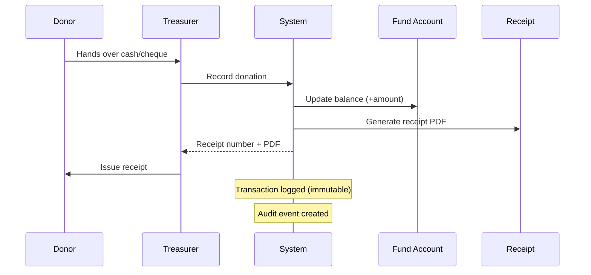
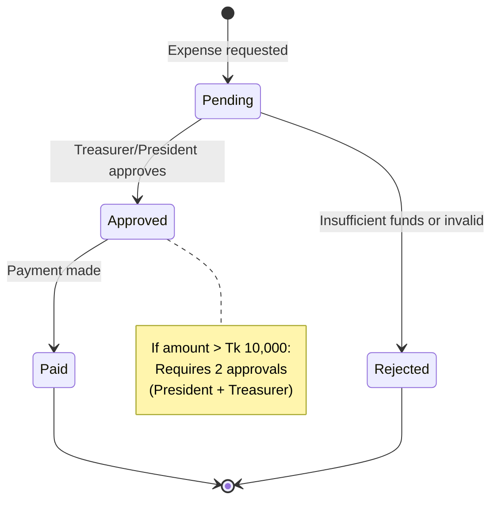

# PHASE_H_FINANCE.md

## Phase Identification

- **Phase**: H
- **Name**: Donation & Finance Management
- **Status**: 🔴 Planned
- **Dependencies**:
  - Phase A (DATABASE_SCHEMA.md) - Finance tables (to be added)
  - Phase B (API_CONTRACT.md) - Finance API endpoints
  - Phase C (PHASE_C_AUTH.md) - Financial permissions
  - Phase D (PHASE_D_COMMITTEE.md) - Committee-based fund allocation

---

## Purpose

This document defines the **donation tracking and financial management system** for Bangladesh Jatiotabadi Jubodal.

**Critical User Intent**: "Donation system must be fully auditable, no hidden transactions, future-ready for compliance"

**Core Functions**:
- Donation intake (online & offline recording)
- District-wise fund allocation
- Purpose tagging for transparency
- Transparent ledger (immutable transaction log)
- Financial reporting (monthly, yearly, audit-ready)
- Budget planning and tracking

---

## Scope Boundaries

### This Phase Controls

✅ **Donation Management**
- Donation recording (cash, bank transfer, mobile money)
- Donor information (anonymous option)
- Receipt generation
- Donation campaigns

✅ **Fund Allocation**
- District-level fund distribution
- Purpose-specific allocations (event, activity, emergency relief)
- Transfer between jurisdictions
- Approval workflow for large transfers

✅ **Transaction Ledger**
- Immutable transaction log
- Double-entry bookkeeping principles
- Transaction categories
- Reconciliation tracking

✅ **Financial Reporting**
- Monthly income/expense reports
- Yearly financial statements
- District-wise fund balances
- Donor reports (tax receipts)
- Audit trail exports

✅ **Budget Management**
- Budget planning by jurisdiction
- Budget vs actual tracking
- Overspending alerts

---

### This Phase Does NOT Control

❌ **Payment Gateway Integration** (Future Enhancement)
- Online payment processing (bKash, Nagad, Rocket)
- This phase defines the data model only

❌ **Accounting Standards** (Owned by Finance Team)
- Bangladesh accounting regulations
- Chart of accounts structure

❌ **Tax Compliance** (Owned by Legal Team)
- Tax deduction rules
- Donor tax receipts format

❌ **Permissions** (Owned by PHASE_C_AUTH.md)
- Who can approve transactions
- Who can view financial reports

---

## Implementation Checklist

### Donation Module
- [ ] Record donation (manual entry)
- [ ] Donor profile management
- [ ] Anonymous donation support
- [ ] Receipt generation (PDF)
- [ ] Donation campaigns

### Fund Management
- [ ] District fund accounts
- [ ] Fund transfer workflow
- [ ] Purpose-specific allocation
- [ ] Approval workflow (>Tk 10,000)

### Financial Reporting
- [ ] Monthly income statement
- [ ] Expense tracking
- [ ] Balance sheet
- [ ] Donor report
- [ ] Audit log export (CSV/PDF)

### Budget Planning
- [ ] Annual budget creation
- [ ] Budget allocation by department
- [ ] Budget vs actual comparison
- [ ] Overspending alerts

---

## Technical Details

### Database Schema (To be added to DATABASE_SCHEMA.md)

#### Table: `fund_accounts`

Represents fund accounts at each jurisdiction level.

```sql
CREATE TABLE fund_accounts (
  id UUID PRIMARY KEY DEFAULT gen_random_uuid(),
  jurisdiction_id UUID NOT NULL REFERENCES jurisdictions(id),
  account_name VARCHAR(255) NOT NULL,
  account_name_bn VARCHAR(255),
  account_type VARCHAR(50) NOT NULL, -- general, designated, restricted
  balance DECIMAL(15,2) NOT NULL DEFAULT 0.00,
  currency VARCHAR(3) DEFAULT 'BDT',
  is_active BOOLEAN DEFAULT TRUE,
  created_at TIMESTAMP DEFAULT NOW(),
  updated_at TIMESTAMP DEFAULT NOW()
);

CREATE UNIQUE INDEX idx_fund_account_jurisdiction 
ON fund_accounts(jurisdiction_id, account_name) WHERE is_active = TRUE;
```

**Account Types**:
- `general`: Unrestricted use for any organizational purpose
- `designated`: Earmarked for specific purpose (e.g., "2026 Election Campaign")
- `restricted`: Donor-restricted (e.g., "Flood Relief Only")

---

#### Table: `donations`

Records all incoming donations.

```sql
CREATE TABLE donations (
  id UUID PRIMARY KEY DEFAULT gen_random_uuid(),
  donor_id UUID REFERENCES users(id), -- nullable for anonymous
  is_anonymous BOOLEAN DEFAULT FALSE,
  donor_name VARCHAR(255), -- For non-member donors
  donor_phone VARCHAR(20),
  donor_email VARCHAR(255),
  donor_address TEXT,
  
  amount DECIMAL(15,2) NOT NULL CHECK (amount > 0),
  currency VARCHAR(3) DEFAULT 'BDT',
  
  payment_method VARCHAR(50) NOT NULL, -- cash, bank_transfer, mobile_money, cheque
  payment_reference VARCHAR(255), -- Transaction ID, cheque number, etc.
  payment_date DATE NOT NULL,
  
  fund_account_id UUID NOT NULL REFERENCES fund_accounts(id),
  purpose VARCHAR(255), -- "General Fund", "Flood Relief", "Election Campaign"
  purpose_bn VARCHAR(255),
  
  campaign_id UUID REFERENCES donation_campaigns(id), -- nullable
  
  receipt_number VARCHAR(50) UNIQUE NOT NULL,
  receipt_issued_at TIMESTAMP,
  receipt_file_path TEXT, -- PDF receipt
  
  recorded_by UUID REFERENCES users(id),
  created_at TIMESTAMP DEFAULT NOW(),
  updated_at TIMESTAMP DEFAULT NOW()
);

CREATE INDEX idx_donations_donor ON donations(donor_id);
CREATE INDEX idx_donations_fund_account ON donations(fund_account_id);
CREATE INDEX idx_donations_date ON donations(payment_date);
CREATE INDEX idx_donations_campaign ON donations(campaign_id);
```

**Receipt Number Format**: `BJD-DON-{YEAR}-{SEQUENTIAL}` (e.g., BJD-DON-2026-000123)

---

#### Table: `transactions`

Immutable ledger of all financial transactions (double-entry).

```sql
CREATE TABLE transactions (
  id UUID PRIMARY KEY DEFAULT gen_random_uuid(),
  transaction_date DATE NOT NULL,
  transaction_type VARCHAR(50) NOT NULL, -- donation, expense, transfer, adjustment
  
  debit_account_id UUID REFERENCES fund_accounts(id),
  credit_account_id UUID REFERENCES fund_accounts(id),
  amount DECIMAL(15,2) NOT NULL CHECK (amount > 0),
  
  description TEXT NOT NULL,
  description_bn TEXT,
  
  reference_type VARCHAR(50), -- donation, expense, activity, event
  reference_id UUID, -- Links to donations, expenses, activities, events
  
  approved_by UUID REFERENCES users(id),
  approved_at TIMESTAMP,
  
  created_by UUID NOT NULL REFERENCES users(id),
  created_at TIMESTAMP DEFAULT NOW()
);

-- Immutable constraint: No UPDATE or DELETE allowed (application-level enforcement)
CREATE INDEX idx_transactions_date ON transactions(transaction_date);
CREATE INDEX idx_transactions_debit ON transactions(debit_account_id);
CREATE INDEX idx_transactions_credit ON transactions(credit_account_id);
CREATE INDEX idx_transactions_type ON transactions(transaction_type);
```

**Double-Entry Example**:
```
Donation of Tk 10,000 received:
- Debit: District Fund Account (asset increases)
- Credit: Donation Income Account (income recognized)
```

**Immutability**: Transactions CANNOT be edited or deleted. Corrections via reversing transactions.

---

#### Table: `expenses`

Records all organizational expenses.

```sql
CREATE TABLE expenses (
  id UUID PRIMARY KEY DEFAULT gen_random_uuid(),
  expense_category VARCHAR(100) NOT NULL, -- event, transport, publicity, office, welfare
  expense_category_bn VARCHAR(100),
  
  amount DECIMAL(15,2) NOT NULL CHECK (amount > 0),
  currency VARCHAR(3) DEFAULT 'BDT',
  
  fund_account_id UUID NOT NULL REFERENCES fund_accounts(id),
  jurisdiction_id UUID NOT NULL REFERENCES jurisdictions(id),
  
  description TEXT NOT NULL,
  description_bn TEXT,
  
  vendor_name VARCHAR(255), -- Who was paid
  vendor_phone VARCHAR(20),
  
  payment_method VARCHAR(50), -- cash, bank_transfer, cheque
  payment_reference VARCHAR(255),
  payment_date DATE NOT NULL,
  
  receipt_file_path TEXT, -- Scanned receipt/invoice
  
  related_activity_id UUID REFERENCES activities(id),
  related_event_id UUID REFERENCES events(id),
  
  requested_by UUID NOT NULL REFERENCES users(id),
  approved_by UUID REFERENCES users(id),
  approved_at TIMESTAMP,
  
  status VARCHAR(50) DEFAULT 'pending', -- pending, approved, rejected, paid
  rejection_reason TEXT,
  
  created_at TIMESTAMP DEFAULT NOW(),
  updated_at TIMESTAMP DEFAULT NOW()
);

CREATE INDEX idx_expenses_fund_account ON expenses(fund_account_id);
CREATE INDEX idx_expenses_jurisdiction ON expenses(jurisdiction_id);
CREATE INDEX idx_expenses_category ON expenses(expense_category);
CREATE INDEX idx_expenses_date ON expenses(payment_date);
```

**Expense Categories**:
- `event`: Event-related costs (venue, refreshments)
- `transport`: Travel, vehicle rental
- `publicity`: Posters, banners, advertisements
- `office`: Rent, utilities, supplies
- `welfare`: Member assistance, emergency relief

---

#### Table: `donation_campaigns`

Tracks fundraising campaigns.

```sql
CREATE TABLE donation_campaigns (
  id UUID PRIMARY KEY DEFAULT gen_random_uuid(),
  campaign_name VARCHAR(255) NOT NULL,
  campaign_name_bn VARCHAR(255),
  description TEXT,
  description_bn TEXT,
  
  goal_amount DECIMAL(15,2), -- nullable for ongoing campaigns
  currency VARCHAR(3) DEFAULT 'BDT',
  
  start_date DATE NOT NULL,
  end_date DATE,
  
  jurisdiction_id UUID REFERENCES jurisdictions(id), -- Central campaign or district-specific
  
  is_active BOOLEAN DEFAULT TRUE,
  created_by UUID REFERENCES users(id),
  created_at TIMESTAMP DEFAULT NOW(),
  updated_at TIMESTAMP DEFAULT NOW()
);

CREATE INDEX idx_campaigns_jurisdiction ON donation_campaigns(jurisdiction_id);
CREATE INDEX idx_campaigns_dates ON donation_campaigns(start_date, end_date);
```

**Campaign Examples**:
- "2026 National Election Fund"
- "Flood Relief for Sylhet District"
- "Shaheed Zia Memorial Construction"

---

#### Table: `budgets`

Annual budget planning.

```sql
CREATE TABLE budgets (
  id UUID PRIMARY KEY DEFAULT gen_random_uuid(),
  fiscal_year INT NOT NULL, -- 2026, 2027
  jurisdiction_id UUID NOT NULL REFERENCES jurisdictions(id),
  
  budget_category VARCHAR(100) NOT NULL, -- Maps to expense categories
  allocated_amount DECIMAL(15,2) NOT NULL CHECK (allocated_amount >= 0),
  
  notes TEXT,
  
  approved_by UUID REFERENCES users(id),
  approved_at TIMESTAMP,
  
  created_at TIMESTAMP DEFAULT NOW(),
  updated_at TIMESTAMP DEFAULT NOW(),
  
  UNIQUE(fiscal_year, jurisdiction_id, budget_category)
);

CREATE INDEX idx_budgets_year_jurisdiction ON budgets(fiscal_year, jurisdiction_id);
```

**Budget Planning Workflow**:
1. District committees submit budget proposals
2. Central committee reviews and approves
3. Budget allocated to fund accounts
4. Actual expenses tracked against budget
5. Monthly variance reports generated

---

### Financial Workflows

#### Donation Workflow



**Fields Required**:
- Amount, payment method, payment date
- Donor info (optional if anonymous)
- Purpose/campaign
- Fund account to credit

**Auto-Actions**:
- Receipt number generated
- Transaction created (debit: Fund Account, credit: Donation Income)
- Balance updated
- Audit log entry

---

#### Expense Approval Workflow



**Approval Rules**:
- Amount ≤ Tk 5,000: Any committee leader can approve
- Amount Tk 5,001 - 10,000: Treasurer or President
- Amount > Tk 10,000: Both Treasurer AND President (or General Secretary)
- All approvals logged

**Payment Recording**:
- After approval, Treasurer marks as "paid"
- Transaction created in ledger
- Fund account balance reduced
- Receipt/invoice attached

---

#### Fund Transfer Workflow

**Scenario**: Central transfers Tk 50,000 to Dhaka District for election campaign.

**Process**:
1. Central committee approves transfer
2. Transaction created:
   - Debit: Dhaka District Fund Account (+Tk 50,000)
   - Credit: Central Fund Account (-Tk 50,000)
3. Both balances updated atomically
4. Transfer note logged: "Election Campaign 2026"
5. Notifications to both jurisdictions

**Restrictions**:
- Can only transfer to child jurisdictions (Central → District, District → Upazila)
- Cannot transfer to parent jurisdictions (ward cannot send to district)
- Both accounts must be active
- Sufficient balance required

---

### Financial Reports

#### 1. Monthly Income Statement

**For**: Each jurisdiction

**Content**:
```
Bangladesh Jatiotabadi Jubo Dal
[Jurisdiction Name] Committee
Income Statement for [Month Year]

INCOME:
  Donations                    Tk 125,000.00
  Membership Fees              Tk   5,000.00
  Other Income                 Tk   2,500.00
  ------------------------------------------
  Total Income                 Tk 132,500.00

EXPENSES:
  Events                       Tk  45,000.00
  Transport                    Tk  12,000.00
  Publicity                    Tk  18,500.00
  Office                       Tk   8,000.00
  Welfare                      Tk  15,000.00
  ------------------------------------------
  Total Expenses               Tk  98,500.00

NET SURPLUS/(DEFICIT)          Tk  34,000.00
```

**API Endpoint**: `GET /api/v1/finance/reports/income-statement?jurisdiction={id}&month={YYYY-MM}`

**Access**: Committee Treasurer, President, General Secretary, Central Leaders, Super Admin

---

#### 2. Balance Sheet

**Current Fund Balances** by jurisdiction:
```
Dhaka District Fund Account: Tk 125,450.00
  - General Fund: Tk 100,000.00
  - Election Campaign Fund: Tk 25,450.00
```

---

#### 3. Donor Report

**For transparency and donor relations**:

```
Donation Report for 2026

Total Donations Received: Tk 5,250,000.00
Number of Donors: 1,247
Average Donation: Tk 4,210.00

Top Purposes:
  1. General Fund: Tk 2,000,000.00
  2. Election Campaign: Tk 1,500,000.00
  3. Flood Relief: Tk 750,000.00
  4. Shaheed Zia Memorial: Tk 500,000.00

By District:
  Dhaka: Tk 1,200,000.00
  Chittagong: Tk 850,000.00
  ...
```

---

#### 4. Budget vs Actual Report

```
Dhaka District
Fiscal Year 2026 - Q1 Budget vs Actual

Category        | Budget     | Actual    | Variance  | %
----------------|------------|-----------|-----------|-----
Events          | 200,000.00 | 145,000.00| +55,000.00| 73%
Transport       |  50,000.00 |  48,500.00|  +1,500.00| 97%
Publicity       | 100,000.00 | 118,500.00| -18,500.00|119% ⚠️
Office          |  30,000.00 |  28,000.00|  +2,000.00| 93%
Welfare         |  80,000.00 |  75,000.00|  +5,000.00| 94%
----------------|------------|-----------|-----------|-----
TOTAL           | 460,000.00 | 415,000.00| +45,000.00| 90%
```

**Alerts**:
- ⚠️ Publicity budget exceeded by 18.5% (Tk 18,500)

---

## Business Logic Rules

### Rule 1: Donation Receipt Mandatory

Every donation MUST have a receipt issued.
- Receipt number unique and sequential
- PDF generated automatically
- Stored in S3/MinIO
- Donor receives physical or email copy

---

### Rule 2: Approval Thresholds

| Amount (BDT) | Approval Required |
|--------------|-------------------|
| ≤ 5,000 | Any committee leader |
| 5,001 - 10,000 | Treasurer or President |
| 10,001 - 50,000 | Treasurer AND President |
| > 50,000 | Committee vote + Central approval |

---

### Rule 3: Transaction Immutability

Once a transaction is committed to the `transactions` table:
- NO UPDATE allowed
- NO DELETE allowed
- Corrections via reversing entries only

**Example Correction**:
```
Original (erroneous):
  Debit: District Fund +10,000
  Credit: Donation Income -10,000
  (Should have been 1,000)

Reversal:
  Debit: District Fund -10,000
  Credit: Donation Income +10,000

Correct Entry:
  Debit: District Fund +1,000
  Credit: Donation Income -1,000
```

---

### Rule 4: Anonymous Donor Privacy

If `is_anonymous = TRUE`:
- Donor name NOT displayed in public reports
- Listed as "Anonymous Donor"
- Donor info accessible only to Super Admin
- Receipt still generated with reference number

---

### Rule 5: Campaign Fund Restrictions

Funds donated to a specific campaign CANNOT be used for other purposes without donor consent (if restricted) or board approval (if designated).

---

## Integration Points

### With Phase C (Auth)
- Permissions: `finance.view`, `finance.record_donation`, `finance.approve_expense`, `finance.generate_report`
- Jurisdiction-based financial data access

### With Phase D (Committee)
- Committee Treasurer role has finance permissions
- Fund accounts linked to committees/jurisdictions

### With Phase E (Activity & Events)
- Expenses linked to activities/events
- Event budgets tracked

### With Audit System
- All financial actions logged
- Transaction immutability ensures audit trail

---

## Testing Requirements

### Donation Tests
- Record cash donation
- Record bank transfer
- Generate receipt PDF
- Anonymous donation privacy

### Expense Tests
- Request expense approval
- Multi-level approval (>Tk 10,000)
- Reject expense
- Link expense to activity/event

### Transaction Tests
- Donation creates correct double-entry
- Expense creates correct transaction
- Fund transfer updates both accounts atomically
- Transaction immutability enforced

### Reporting Tests
- Generate monthly income statement
- Budget vs actual variance calculation
- Donor report aggregation
- Export to CSV/PDF

---

## Future Extensibility

### Online Donation Portal

- bKash/Nagad/Rocket integration
- Online donation form
- Instant receipt email
- Donation widget for website

### Automated Reconciliation

- Bank statement upload
- Auto-match transactions
- Flag discrepancies

### Multi-Currency Support

- Support USD, EUR for international donors
- Exchange rate tracking
- Multi-currency reports

### Blockchain Ledger (Advanced)

- Immutable blockchain-backed ledger
- Public transparency via blockchain explorer
- Cryptographic proof of transactions

---

এই ডকুমেন্ট ভাঙলে সিস্টেম ভাঙবে।
এই ডকুমেন্ট ঠিক থাকলে – যত বড়ই হোক – সিস্টেম স্থিতিশীল থাকবে।
